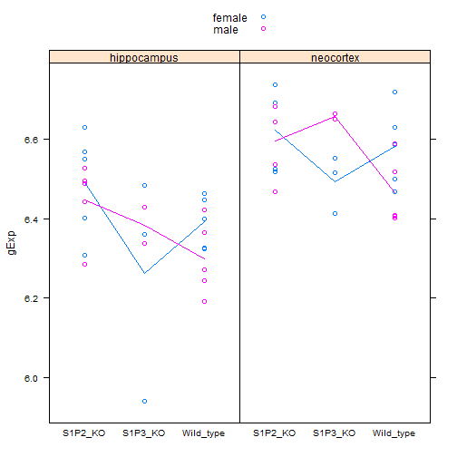
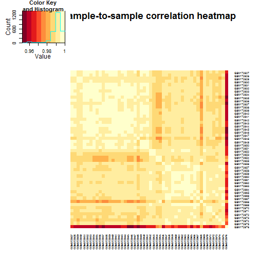

Homework 01     Yue SUN 
========================================================

## Q0 (0 pts) Intake

```r
Data <- read.table("GSE7191-data.txt", sep = "\t", header = T, row.names = 1)
metaData <- read.table("GSE7191-design.txt", sep = "\t", header = T, row.names = 1)
metaData <- metaData[colnames(Data), ]
all(row.names(metaData) == colnames(Data))
```

```
## [1] TRUE
```


```r
metaData$sampleID <- rownames(metaData)
metaData$DateRun <- as.factor(as.Date(metaData$DateRun, format = "%m/%d/%y"))
metaData$Genotype <- as.factor(metaData$Genotype)
str(metaData)
```

```
## 'data.frame':	50 obs. of  5 variables:
##  $ DateRun    : Factor w/ 8 levels "2003-08-14","2003-08-21",..: 2 2 2 2 3 1 1 3 3 3 ...
##  $ Genotype   : Factor w/ 3 levels "S1P2_KO","S1P3_KO",..: 3 3 3 3 3 3 3 3 3 3 ...
##  $ BrainRegion: Factor w/ 2 levels "hippocampus",..: 2 2 2 2 2 2 2 2 2 2 ...
##  $ Sex        : Factor w/ 2 levels "female","male": 2 2 2 2 2 1 1 1 1 1 ...
##  $ sampleID   : chr  "GSM172927" "GSM172928" "GSM172929" "GSM172930" ...
```

## Q1 (2 points) What are the basic characteristics of the data and meta-data?

### Q1a: How many probes? How many samples?

Number of probes:

```r
nrow(Data)
```

```
## [1] 12422
```


Number of samples:

```r
nrow(metaData)
```

```
## [1] 50
```

### Q1b: What is the breakdown of samples for Genotype, BrainRegion, Sex, and DateRun?

We have a summarized breakdown of samples for each factor:

```r
summary(metaData)
```

```
##        DateRun       Genotype       BrainRegion     Sex    
##  2003-08-14:8   S1P2_KO  :20   hippocampus:25   female:26  
##  2003-08-21:8   S1P3_KO  :10   neocortex  :25   male  :24  
##  2003-09-11:7   Wild_type:20                               
##  2003-10-23:7                                              
##  2004-01-16:7                                              
##  2003-12-18:5                                              
##  (Other)   :8                                              
##    sampleID        
##  Length:50         
##  Class :character  
##  Mode  :character  
##                    
##                    
##                    
## 
```

Furthermore, the cross-tabulations show more information in detail.

```r
table(metaData$Genotype, metaData$BrainRegion)
```

```
##            
##             hippocampus neocortex
##   S1P2_KO            10        10
##   S1P3_KO             5         5
##   Wild_type          10        10
```

```r
table(metaData$DateRun, metaData$Genotype)
```

```
##             
##              S1P2_KO S1P3_KO Wild_type
##   2003-08-14       4       0         4
##   2003-08-21       0       0         8
##   2003-09-11       0       0         7
##   2003-10-23       7       0         0
##   2003-12-18       1       3         1
##   2004-01-16       0       7         0
##   2004-03-11       4       0         0
##   2004-07-23       4       0         0
```

```r
table(metaData$DateRun, metaData$BrainRegion)
```

```
##             
##              hippocampus neocortex
##   2003-08-14           4         4
##   2003-08-21           4         4
##   2003-09-11           3         4
##   2003-10-23           4         3
##   2003-12-18           2         3
##   2004-01-16           4         3
##   2004-03-11           2         2
##   2004-07-23           2         2
```

```r
table(metaData$Sex, metaData$Genotype)
```

```
##         
##          S1P2_KO S1P3_KO Wild_type
##   female      10       6        10
##   male        10       4        10
```

```r
table(metaData$Sex, metaData$BrainRegion)
```

```
##         
##          hippocampus neocortex
##   female          13        13
##   male            12        12
```

Here is a cross tabulation with all the counts for all combinations of 4 variables.

```r
table(metaData$Genotype, metaData$DateRun, metaData$Sex, metaData$BrainRegion)
```

```
## , ,  = female,  = hippocampus
## 
##            
##             2003-08-14 2003-08-21 2003-09-11 2003-10-23 2003-12-18
##   S1P2_KO            2          0          0          1          0
##   S1P3_KO            0          0          0          0          1
##   Wild_type          2          0          3          0          0
##            
##             2004-01-16 2004-03-11 2004-07-23
##   S1P2_KO            0          0          2
##   S1P3_KO            2          0          0
##   Wild_type          0          0          0
## 
## , ,  = male,  = hippocampus
## 
##            
##             2003-08-14 2003-08-21 2003-09-11 2003-10-23 2003-12-18
##   S1P2_KO            0          0          0          3          0
##   S1P3_KO            0          0          0          0          0
##   Wild_type          0          4          0          0          1
##            
##             2004-01-16 2004-03-11 2004-07-23
##   S1P2_KO            0          2          0
##   S1P3_KO            2          0          0
##   Wild_type          0          0          0
## 
## , ,  = female,  = neocortex
## 
##            
##             2003-08-14 2003-08-21 2003-09-11 2003-10-23 2003-12-18
##   S1P2_KO            2          0          0          1          0
##   S1P3_KO            0          0          0          0          2
##   Wild_type          2          0          3          0          0
##            
##             2004-01-16 2004-03-11 2004-07-23
##   S1P2_KO            0          0          2
##   S1P3_KO            1          0          0
##   Wild_type          0          0          0
## 
## , ,  = male,  = neocortex
## 
##            
##             2003-08-14 2003-08-21 2003-09-11 2003-10-23 2003-12-18
##   S1P2_KO            0          0          0          2          1
##   S1P3_KO            0          0          0          0          0
##   Wild_type          0          4          1          0          0
##            
##             2004-01-16 2004-03-11 2004-07-23
##   S1P2_KO            0          2          0
##   S1P3_KO            2          0          0
##   Wild_type          0          0          0
```

In all, I think the experimental design is relatively reasonable. But we could see that the "DataRun"" factor is unbalanced among the whole, especially the cross-tabulation between DataRun and Genotype,i.e. 6 of 8 days had all samples belonging to the same Genotype. As long as if what day samples are collected does not matter , the experiment should still be valid.

### Q1c: Create a plot showing the gene expression data for one probe.

```r
library(lattice)
myRow <- sample(seq_len(nrow(Data)), size = 1)
myProbe <- rownames(Data)[myRow]
myDat <- data.frame(metaData, gExp = as.vector(t(Data[myRow, ])))
myDat$grp <- with(myDat, interaction(BrainRegion, Sex, lex.order = TRUE))
stripplot(gExp ~ Genotype | BrainRegion, myDat, group = Sex, auto.key = TRUE, 
    type = c("p", "a"))
```

 

### Q1d: Report the average expression of the selected probe for all possible combinations of Genotype, BrainRegion and Sex.


```r
with(myDat, tapply(gExp, list(Genotype, BrainRegion, Sex), mean))
```

```
## , , female
## 
##           hippocampus neocortex
## S1P2_KO         6.492     6.623
## S1P3_KO         6.261     6.494
## Wild_type       6.392     6.582
## 
## , , male
## 
##           hippocampus neocortex
## S1P2_KO         6.448     6.596
## S1P3_KO         6.383     6.658
## Wild_type       6.299     6.465
```

## Q2 (4 points) Examine the sample correlation matrix.

### Q2a: Depict the sample-to-sample correlations in a heatmap.

```r
library(gplots)
```

```
## KernSmooth 2.23 loaded
## Copyright M. P. Wand 1997-2009
## 
## Attaching package: 'gplots'
## 
## The following object is masked from 'package:stats':
## 
##     lowess
```

```r
library(RColorBrewer)
```


```r
cols <- c(rev(brewer.pal(9, "YlOrRd")))  #, '#FFFFFF' )
heatmap.2(cor(Data), Rowv = NA, Colv = NA, symm = T, trace = "none", dendrogram = "none", 
    col = cols, cexCol = 0.5, cexRow = 0.5, main = paste("Sample-to-sample correlation heatmap"))
```

 

### Q2b: Identify the outlier sample.


```r
colnames(Data)
```

```
##  [1] "GSM172927" "GSM172928" "GSM172929" "GSM172930" "GSM172931"
##  [6] "GSM172932" "GSM172933" "GSM172934" "GSM172935" "GSM172936"
## [11] "GSM172937" "GSM172938" "GSM172939" "GSM172940" "GSM172941"
## [16] "GSM172942" "GSM172943" "GSM172944" "GSM172945" "GSM172946"
## [21] "GSM172947" "GSM172948" "GSM172949" "GSM172950" "GSM172951"
## [26] "GSM172952" "GSM172953" "GSM172954" "GSM172955" "GSM172956"
## [31] "GSM172957" "GSM172958" "GSM172959" "GSM172960" "GSM172961"
## [36] "GSM172962" "GSM172963" "GSM172964" "GSM172965" "GSM172966"
## [41] "GSM172967" "GSM172968" "GSM172969" "GSM172970" "GSM172971"
## [46] "GSM172972" "GSM172973" "GSM172974" "GSM172975" "GSM172976"
```

From the heatmap above, we can easily find the color for row and column "GSM172976" is different from other samples. But we still need to confrim this with more accurate methods,e.g. comparing the correlation values.

```r
target <- apply(cor(Data), 1, quantile, probs = 1:5/50)
targetpool <- data.frame(cor = as.vector(target), ID = factor(rep(rownames(metaData), 
    each = 5), levels = rownames(metaData)), qtile = 1:5/50)
dotplot(ID ~ cor, targetpool)
```

 

```r
(Outlier <- names(which.min(colMeans(target))))
```

```
## [1] "GSM172976"
```

Thus, the outlier sample is "GSM172976".

### Q2c: Examine the outlier in the context of its experimental group.


```r
metaData$grp <- with(metaData, interaction(Genotype, BrainRegion, Sex))
(featureGrp <- metaData[Outlier, "grp"])
```

```
## [1] S1P3_KO.hippocampus.female
## 12 Levels: S1P2_KO.hippocampus.female ... Wild_type.neocortex.male
```


```r
library(lattice)
library(grid)
library(hexbin)
```

From the metaData, we've got "GSM172974","GSM172975" and "GSM172976" are in the same group. So we compare the two normal samples and the outlier sample via hexagonal binning, one of the high volume scatterplottings.

```r
splom(Data[metaData$grp == featureGrp], panel = panel.hexbinplot)
```

 

## Q3 (4 points) Normalization, what it can and can't do.
### Q3a: Make boxplots.

First we do the normalization via preprocessCore.

```r
library(preprocessCore)
```


```r
DataNorm <- as.data.frame(normalize.quantiles(as.matrix(Data)))
dimnames(DataNorm) <- dimnames(Data)
```


```r
boxCols <- rep(brewer.pal(11, "RdGy")[7], 50)
boxCols[which(names(DataNorm) == Outlier)] <- brewer.pal(11, "RdGy")[4]
```

First gene expression boxplots no normalization:

```r
boxplot(Data, border = boxCols, main = "1. The data as provided", las = 2, cex.axis = 0.8)
```

 

After normalization:

```r
boxplot(DataNorm, border = boxCols, main = "2. The data after quantile normalization", 
    las = 2, cex.axis = 0.8)
```

 

For the data before quantile normalization, we can see that the boxplots of the samples are a little bit different from each other while the data after quantile normalization are nearly the same. That is because the quantile normalization will force all samples to have the same distribution on expression.

### Q3b: Did normalization fix the outlier?


```r
heatmap.2(cor(DataNorm), Rowv = NA, Colv = NA, symm = T, trace = "none", dendrogram = "none", 
    col = cols, cexCol = 0.5, cexRow = 0.5, main = paste("Sample-to-sample correlation heatmap after normalization"))
```

 

Obviously, the outlier is not gone.

### Q3c: Form a dataset that omits the outlier and quantile normalize it.

First, we remove the outlier to make a clean data.

```r
DataClean <- Data[-which(names(Data) == Outlier)]
str(DataClean, list.len = 6)
```

```
## 'data.frame':	12422 obs. of  49 variables:
##  $ GSM172927: num  4.28 6.71 5.3 5.94 6.55 ...
##  $ GSM172928: num  4.12 6.78 5.24 5.82 6.61 ...
##  $ GSM172929: num  4.52 6.49 4.93 5.99 6.57 ...
##  $ GSM172930: num  4.22 6.45 4.87 5.92 6.51 ...
##  $ GSM172931: num  4.39 6.68 5.23 6.11 6.59 ...
##  $ GSM172932: num  4.23 6.56 5.01 5.95 6.85 ...
##   [list output truncated]
```

```r
metaDataClean <- subset(metaData, !rownames(metaData) == Outlier)
str(metaDataClean)
```

```
## 'data.frame':	49 obs. of  6 variables:
##  $ DateRun    : Factor w/ 8 levels "2003-08-14","2003-08-21",..: 2 2 2 2 3 1 1 3 3 3 ...
##  $ Genotype   : Factor w/ 3 levels "S1P2_KO","S1P3_KO",..: 3 3 3 3 3 3 3 3 3 3 ...
##  $ BrainRegion: Factor w/ 2 levels "hippocampus",..: 2 2 2 2 2 2 2 2 2 2 ...
##  $ Sex        : Factor w/ 2 levels "female","male": 2 2 2 2 2 1 1 1 1 1 ...
##  $ sampleID   : chr  "GSM172927" "GSM172928" "GSM172929" "GSM172930" ...
##  $ grp        : Factor w/ 12 levels "S1P2_KO.hippocampus.female",..: 12 12 12 12 12 6 6 6 6 6 ...
```

Then, we do the quantile normalization again on the clean data.

```r
DataNormClean <- as.data.frame(normalize.quantiles(as.matrix(DataClean)))
dimnames(DataNormClean) <- dimnames(DataClean)
str(DataNormClean, list.len = 6)
```

```
## 'data.frame':	12422 obs. of  49 variables:
##  $ GSM172927: num  4.32 6.71 5.32 5.96 6.56 ...
##  $ GSM172928: num  4.21 6.83 5.34 5.91 6.66 ...
##  $ GSM172929: num  4.53 6.55 4.95 6.04 6.63 ...
##  $ GSM172930: num  4.22 6.5 4.9 5.95 6.55 ...
##  $ GSM172931: num  4.4 6.68 5.23 6.11 6.58 ...
##  $ GSM172932: num  4.23 6.56 5.02 5.95 6.85 ...
##   [list output truncated]
```


### Q3d Re-make the heatmap of the sample correlation matrix, now that the worst outlier is gone. Interpret what you see.


```r
heatmap.2(cor(DataNormClean), Rowv = NA, Colv = NA, symm = T, trace = "none", 
    dendrogram = "none", col = cols, cexCol = 0.5, cexRow = 0.5, main = paste("New heatmap after normalization without outlier"))
```

 

The new heatmap looks much better. Without outlier, it is easier to see contrast within the heatmap.
### Q3e: Remake the expression boxplots for all samples before moving on to differential expression analysis.


```r
ncol(DataNormClean)
```

```
## [1] 49
```

There remain 49 samples.
I do boxplotting on the new dataset again.

```r
boxplot(DataNormClean, main = "Data without outlier (quantile-normalized)", 
    las = 2, cex.axis = 0.8)
```

 

It looks like they are the same.

## Q4 (5 points) For each probe, test if it has differential expression across the three genotypes within the neocortex brain region only.

First, to set up new data set in neocortex only for this session:


```r
Neometa <- subset(metaData[-which(rownames(metaData) %in% "GSM172976"), ], BrainRegion == 
    "neocortex")
NeoData <- data.frame(DataClean)[, rownames(Neometa)]
```


### Q4a: Write out, in an equation or English or, ideally, both, the model you are fitting.

observed expression = wild type expression + knockout effect + noise
    yij=米+而j+??iji﹋{1,2,...,nj}j﹋{wt,S1P2,S1P3}而wt=0E(??ij)=0V(??ij)=考2??ijiid
    
Here is the hypothesis test we will conduct:  H0:而S1P2=而S1P3=0

### Q4b: Explore your hits.

```r
library(limma)
```


1. Ordering the probes by p-value:


```r
NeoDesMat <- model.matrix(~Genotype, Neometa)
NeoFit <- lmFit(NeoData, NeoDesMat)
NeoEbFit <- eBayes(NeoFit)
dsHits <- topTable(NeoEbFit, coef = grep("Genotype", colnames(coef(NeoEbFit))), 
    n = Inf)
```


2. Ordering the samples by genotype:


```r
Neometa <- Neometa[order(Neometa$Genotype), ]
NeoData <- NeoData[, match(rownames(Neometa), colnames(NeoData))]
```


3. Finding the top 50 probes:

```r
NeoSubData <- NeoData[rownames(dsHits[1:50, ]), ]
```


4.Ploting correlation heatmap:

```r
heatmap.2(cor(NeoSubData), Rowv = NA, Colv = NA, symm = T, trace = "none", dendrogram = "none", 
    col = cols, cexCol = 0.5, cexRow = 0.5, main = paste(" Top 50 hits correlation heatmap"))
```

 


### Q4c: Count your hits.


```r
cutoff <- 0.001
```

Get the false discovery rate:

```r
cutdsHits <- subset(dsHits, P.Value < cutoff)
(nrow(cutdsHits))
```

```
## [1] 101
```

```r
(fdr <- dsHits[50, ]$adj.P.Val)
```

```
## [1] 0.0858
```

So the number of the false discoveries is:

```r
(fd <- dsHits[50, ]$adj.P.Val * 50)
```

```
## [1] 4.29
```

Thus, there are 101 hits. The fdr is 0.0858 and 4.29 of these hits are expected to be false discouveries.

### Q4d: Plot the gene expression data for a few top hits and a few boring probes.
DIY functions :


```r
prepareData <- function(myGenes, myDat, myDes) {
    miniDat <- t(myDat[myGenes, ])
    miniDat <- data.frame(gExp = as.vector(miniDat), gene = factor(rep(colnames(miniDat), 
        each = nrow(miniDat)), levels = colnames(miniDat)))
    miniDat <- suppressWarnings(data.frame(myDes, miniDat))
    miniDat
}
stripplotIt <- function(myData, ...) {
    stripplot(gExp ~ Genotype | gene, myData, group = BrainRegion, auto.key = TRUE, 
        jitter.data = TRUE, type = c("p", "a"), grid = TRUE, ...)
}
```

Select a few exiciting probes and boring probes.

```r
exiProbe <- dsHits[1:3, c("P.Value", "adj.P.Val")]
borProbe <- dsHits[10000:10002, c("P.Value", "adj.P.Val")]
sampleProbe <- rbind(exiProbe, borProbe)
sampleProbe$probe <- c(rep("exciting", 3), rep("boring", 3))
```

The plots of the boring probes and exciting probes are shown below:

```r
sampleDat <- prepareData(rownames(sampleProbe), NeoData, Neometa)
stripplotIt(sampleDat)
```

 

Comments:The upper plots show the boring probes which are really flat. That means no changes during the genotypes; The down plots are showing that there is differential expression among the three genotypes for these probes.

### Q4e: Find probes where the expression in the S1P3 knockout is different from that of wild type.

Prepare the contrast matrix first:

```r
cont.matrix <- makeContrasts(S1P3Vswt = GenotypeS1P3_KO - GenotypeWild_type, 
    levels = NeoDesMat)
NeoFitCont <- contrasts.fit(NeoFit, cont.matrix)
NeoEbFitCont <- eBayes(NeoFitCont)
cutoff <- 0.1
```

Get a subset of probes that have different expression in S1P3 and wild type:

```r
S1P3wtSame <- subset(toptable(NeoEbFitCont, adjust.method = "fdr", n = Inf), 
    adj.P.Val < cutoff)
(nrow(S1P3wtSame))
```

```
## [1] 135
```

There are 135 hits when the control FDR is 0.10.

## Q5 (5 points) Differential expression analysis for Genotype * BrainRegion.
prepare the clean data:


```r
str(metaDataClean)
```

```
## 'data.frame':	49 obs. of  6 variables:
##  $ DateRun    : Factor w/ 8 levels "2003-08-14","2003-08-21",..: 2 2 2 2 3 1 1 3 3 3 ...
##  $ Genotype   : Factor w/ 3 levels "S1P2_KO","S1P3_KO",..: 3 3 3 3 3 3 3 3 3 3 ...
##  $ BrainRegion: Factor w/ 2 levels "hippocampus",..: 2 2 2 2 2 2 2 2 2 2 ...
##  $ Sex        : Factor w/ 2 levels "female","male": 2 2 2 2 2 1 1 1 1 1 ...
##  $ sampleID   : chr  "GSM172927" "GSM172928" "GSM172929" "GSM172930" ...
##  $ grp        : Factor w/ 12 levels "S1P2_KO.hippocampus.female",..: 12 12 12 12 12 6 6 6 6 6 ...
```

```r
str(DataNormClean, list.len = 6)
```

```
## 'data.frame':	12422 obs. of  49 variables:
##  $ GSM172927: num  4.32 6.71 5.32 5.96 6.56 ...
##  $ GSM172928: num  4.21 6.83 5.34 5.91 6.66 ...
##  $ GSM172929: num  4.53 6.55 4.95 6.04 6.63 ...
##  $ GSM172930: num  4.22 6.5 4.9 5.95 6.55 ...
##  $ GSM172931: num  4.4 6.68 5.23 6.11 6.58 ...
##  $ GSM172932: num  4.23 6.56 5.02 5.95 6.85 ...
##   [list output truncated]
```


### Q5a: Fit a 3x2 full factorial model.

```r
library(limma)
ffDesMat <- model.matrix(~Genotype * BrainRegion, metaDataClean)
ffFit <- lmFit(DataNormClean, ffDesMat)
ebFfFit <- eBayes(ffFit)
cutoff <- 0.001
dsHits <- topTable(ebFfFit, coef = which(colnames(coef(ffFit)) != "(Intercept)"), 
    n = Inf, p.value = cutoff)
nrow(dsHits)
```

```
## [1] 1524
```

There are 1524 probes have an overall BH-adjusted p-value less than 1e-3.


### Q5b: Test the null hypothesis that BrainRegion doesn't matter, i.e. that all terms involving BrainRegion are zero.

```r
cutoff <- 0.1
BRHits <- topTable(ebFfFit, coef = grep("BrainRegion", colnames(coef(ebFfFit))), 
    n = Inf)
sum(BRHits$adj.P.Val < cutoff)
```

```
## [1] 3227
```

There is 3227 probe with BH-adjusted p-value less than 0.1.

###Q5c: Highlight some probes where BrainRegion does and does not matter.

The plots of some probes where BrainRegion does and does not matter are shown below.

```r
sampleDat <- prepareData(c(rownames(BRHits[1:4, ]), rownames(BRHits[5000:5003, 
    ])), DataNormClean, metaDataClean)
stripplotIt(sampleDat)
```

 

The upper four plots in the first row are from the boring probes. We can see that the two lines are almost superposed, which suggests that BrainRegion does not matter for these four probes. The down four plots are from the exciting probes. We can see that the two lines are parallel and relatively far from each other, showing that BrainRegion does matter for these probes

### Q5d: Test the null hypothesis that Genotype doesn't matter, i.e. that all terms involving Genotype are zero.


```r
cutoff <- 0.1
GenoHits <- topTable(ebFfFit, coef = grep("Genotype", colnames(coef(ebFfFit))), 
    adjust.method = "BH", n = Inf)
sum(GenoHits$adj.P.Val < cutoff)
```

```
## [1] 141
```

There are 141 probes have a BH-adjusted p-value less than 0.1.


```r
densityplot(~BRHits$adj.P.Val + GenoHits$adj.P.Val, auto.key = TRUE, plot.points = FALSE, 
    n = 300)
```

 


The number of probes that have statistically different expression among BrainRegion (3227) is  much larger than the number of probes that have statistically different expression among Genotype (141).
From the density plot we can also see that most probes have q-values related with Genotype close to 1, and only a few probes have related p-values close to 0. This suggests that very few probes are influenced by Genotype. But quite alot of probes have q-values related with brain region are close to 0. Generally speaking, brain region has greater influence on gene expression than genotype .

