HOMEWORK 02      Yue Sun
========================================================

## Q1) Microarray Analysis

### a) Load Microarray Data

```r
array <- read.table("GSE37599-data.tsv", header = TRUE, row.names = 1)
str(array)
```

```
## 'data.frame':	10928 obs. of  6 variables:
##  $ b1: num  11.15 2.16 1.49 9.01 6.95 ...
##  $ b2: num  6.8 3.18 1.43 9.46 6.9 ...
##  $ b3: num  6.71 3.13 1.82 9.23 6.96 ...
##  $ c1: num  10.95 2.5 1.46 8.97 6.85 ...
##  $ c2: num  6.7 3.05 2.08 9.28 6.9 ...
##  $ c3: num  11.07 2.44 1.62 9 6.89 ...
```

```r
nrow(array)
```

```
## [1] 10928
```

```r
ncol(array)
```

```
## [1] 6
```

```r
names(array)
```

```
## [1] "b1" "b2" "b3" "c1" "c2" "c3"
```

This dataset has 10928 rows and 6 columns. The row represents each gene while column represents each sample. The column names are"b1" "b2" "b3" "c1" "c2" "c3". Since we are given there are 3 replicates for 2 conditions totally 6 samples in the study, I think "b"" stands for "batch" and "c" stands for "chemostat". The number indicates the order of the replicates. For example, b1 represents the first replicate of the batch codition while c3 represents the third replicate of the chemostat condition.


### b) Identify Sample Swap
i. (High volume) scatter plot matrix.

```r
library(hexbin)
```

```
## Loading required package: grid
## Loading required package: lattice
```

```r
splom(array, panel = panel.hexbinplot)
```

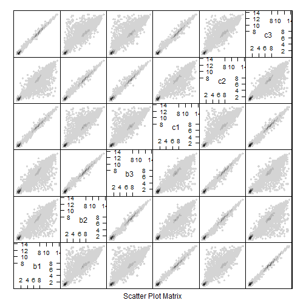 

In the scatter plot matrix, I notice some dots are intensively located on y=x line and the others are not. According to this, I find two groups:(b1, c1, c3) Vs (b2, b3, c2). So the swapped samples are b1 and c2.


ii. A heatmap of the first 100 genes (you can try more but it gets slow).

```r
heatmap(as.matrix(array[1:100, ]))
```

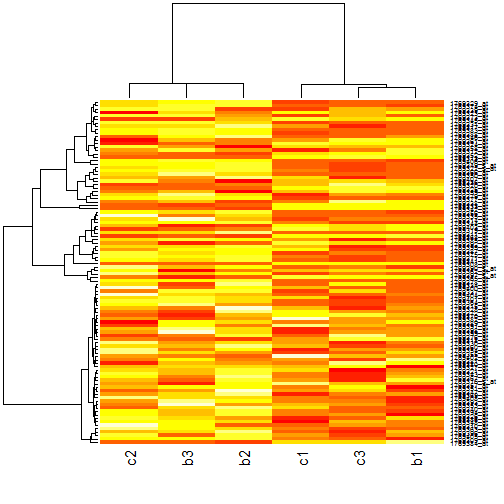 

Visually, the color of group (c2+b3+b2) is lighter than the group (c1+c3+b1). Again, I think c2 and b1 are the swapped samples.


iii. Compute the Pearson correlation of the samples and plot the results using a heatmap.


```r
(pearson.array <- cor(array))
```

```
##        b1     b2     b3     c1     c2     c3
## b1 1.0000 0.9625 0.9621 0.9984 0.9679 0.9989
## b2 0.9625 1.0000 0.9980 0.9658 0.9977 0.9629
## b3 0.9621 0.9980 1.0000 0.9649 0.9973 0.9629
## c1 0.9984 0.9658 0.9649 1.0000 0.9708 0.9978
## c2 0.9679 0.9977 0.9973 0.9708 1.0000 0.9686
## c3 0.9989 0.9629 0.9629 0.9978 0.9686 1.0000
```

```r
heatmap(pearson.array)
```

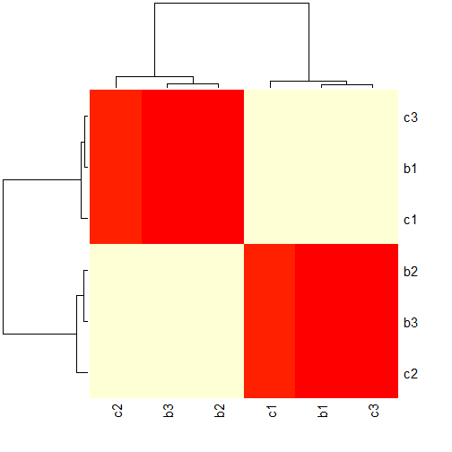 

Judging from the pearson correlation value of the samples, it is easy to find some are high (around 0.99) while the others are relatively lower (around 0.96 or 0.97). And the heatmap shows even more obviously: c1+b1+c3 Vs b2+b3+c2. So the swapped samples are still b1 and c2.


iv. Scatterplot the six data samples with respect to the first two principal components and label the samples.


```r
pca <- prcomp(t(array))
pcadata <- data.frame(PC1 = pca$x[, "PC1"], PC2 = pca$x[, "PC2"], name = rownames(pca$x))
plot(PC2 ~ PC1, pcadata, type = "n")
with(pcadata, text(PC1, PC2, labels = name))
```

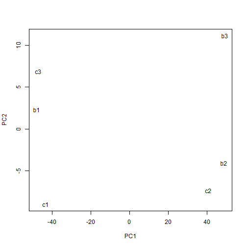 

From the PCA plot, the group of (c1,c3,b1) is one side while the group of (c2, b2, b3) is on the opposite side. That indicates again b1 and c2 are the swapped samples.


### c) Microarray Differential Expression
Let us check the data first:

```r
head(array)
```

```
##                b1    b2    b3     c1    c2     c3
## 1769308_at 11.146 6.796 6.708 10.946 6.699 11.071
## 1769309_at  2.164 3.177 3.129  2.498 3.047  2.444
## 1769310_at  1.488 1.427 1.816  1.462 2.079  1.623
## 1769311_at  9.006 9.462 9.235  8.972 9.277  9.005
## 1769312_at  6.946 6.896 6.955  6.851 6.900  6.893
## 1769313_at  7.815 6.600 6.534  7.770 6.564  7.852
```


We will swap b1 and c2:

```r
swap <- c("b1", "c2")
names(array)[match(swap, names(array))] <- rev(swap)
head(array)
```

```
##                c2    b2    b3     c1    b1     c3
## 1769308_at 11.146 6.796 6.708 10.946 6.699 11.071
## 1769309_at  2.164 3.177 3.129  2.498 3.047  2.444
## 1769310_at  1.488 1.427 1.816  1.462 2.079  1.623
## 1769311_at  9.006 9.462 9.235  8.972 9.277  9.005
## 1769312_at  6.946 6.896 6.955  6.851 6.900  6.893
## 1769313_at  7.815 6.600 6.534  7.770 6.564  7.852
```

We will reorder the data from small number to big number:

```r
array <- array[, order(colnames(array))]
head(array)
```

```
##               b1    b2    b3     c1     c2     c3
## 1769308_at 6.699 6.796 6.708 10.946 11.146 11.071
## 1769309_at 3.047 3.177 3.129  2.498  2.164  2.444
## 1769310_at 2.079 1.427 1.816  1.462  1.488  1.623
## 1769311_at 9.277 9.462 9.235  8.972  9.006  9.005
## 1769312_at 6.900 6.896 6.955  6.851  6.946  6.893
## 1769313_at 6.564 6.600 6.534  7.770  7.815  7.852
```

To check what we've done visually, we will make some plots again:


```r
splom(array, panel = panel.hexbinplot)
```

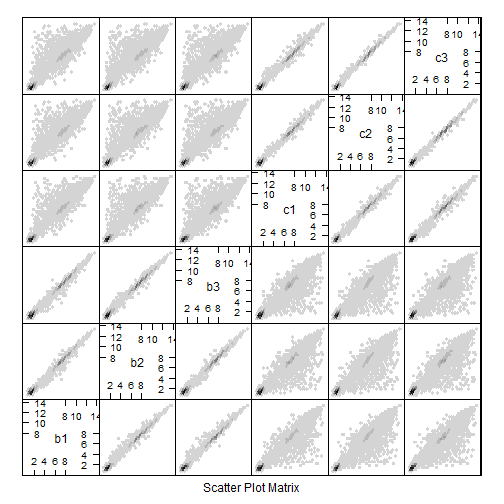 

```r
heatmap(as.matrix(array[1:100, ]))
```

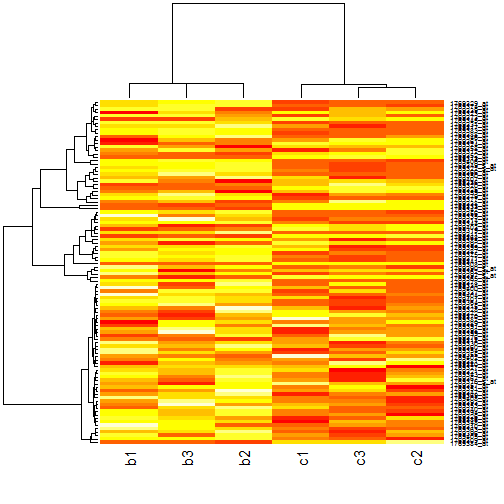 

```r
heatmap(cor(array))
```

 

We save the new data after processing:


```r
write.table(array, "array-post.tsv", row.names = TRUE, col.names = NA)
```

The next step for DEA is to create a factor for the groups.

```r
(group <- factor(c("b", "b", "b", "c", "c", "c")))
```

```
## [1] b b b c c c
## Levels: b c
```

Now we define the design matrix for the data.

```r
(des <- model.matrix(~group))
```

```
##   (Intercept) groupc
## 1           1      0
## 2           1      0
## 3           1      0
## 4           1      1
## 5           1      1
## 6           1      1
## attr(,"assign")
## [1] 0 1
## attr(,"contrasts")
## attr(,"contrasts")$group
## [1] "contr.treatment"
```

Afterawards, we will do fit the data with limma.

```r
library(limma)
fit <- lmFit(array, des)
fit <- eBayes(fit)
all <- topTable(fit, coef = 2, n = Inf, sort.by = "none")
```

We will retrive the gene id by using the yeast2.db package from Bioconductor.

```r
# source('http://bioconductor.org/biocLite.R') biocLite('yeast2.db')
library(yeast2.db)
```

```
## Loading required package: AnnotationDbi
## Loading required package: BiocGenerics
## Loading required package: parallel
## 
## Attaching package: 'BiocGenerics'
## 
## The following objects are masked from 'package:parallel':
## 
##     clusterApply, clusterApplyLB, clusterCall, clusterEvalQ,
##     clusterExport, clusterMap, parApply, parCapply, parLapply,
##     parLapplyLB, parRapply, parSapply, parSapplyLB
## 
## The following object is masked from 'package:limma':
## 
##     plotMA
## 
## The following object is masked from 'package:stats':
## 
##     xtabs
## 
## The following objects are masked from 'package:base':
## 
##     anyDuplicated, append, as.data.frame, as.vector, cbind,
##     colnames, duplicated, eval, evalq, Filter, Find, get,
##     intersect, is.unsorted, lapply, Map, mapply, match, mget,
##     order, paste, pmax, pmax.int, pmin, pmin.int, Position, rank,
##     rbind, Reduce, rep.int, rownames, sapply, setdiff, sort,
##     table, tapply, union, unique, unlist
## 
## Loading required package: Biobase
## Welcome to Bioconductor
## 
##     Vignettes contain introductory material; view with
##     'browseVignettes()'. To cite Bioconductor, see
##     'citation("Biobase")', and for packages 'citation("pkgname")'.
## 
## Loading required package: org.Sc.sgd.db
## Loading required package: DBI
```

Package these results in a data frame with six columns:

```r

probe.ids <- row.names(all)
gene.ids <- unlist(mget(probe.ids, yeast2ORF))
limma.results <- data.frame(probe.ids, gene.ids, all$P.Value, all$adj.P.Val, 
    all$logFC, all$t)
colnames(limma.results) <- c("probe.id", "gene.id", "p.value", "q.value", "log.fc", 
    "test.stat")
str(limma.results)
```

```
## 'data.frame':	10928 obs. of  6 variables:
##  $ probe.id : Factor w/ 10928 levels "1769308_at","1769309_at",..: 1 2 3 4 5 6 7 8 9 10 ...
##  $ gene.id  : Factor w/ 5657 levels "YAL001C","YAL002W",..: 3296 NA NA 789 1508 1813 1317 NA NA 3979 ...
##  $ p.value  : num  1.67e-11 7.47e-05 1.41e-01 3.22e-03 7.61e-01 ...
##  $ q.value  : num  1.40e-08 3.72e-04 2.30e-01 9.49e-03 8.32e-01 ...
##  $ log.fc   : num  4.3199 -0.7489 -0.2495 -0.3299 -0.0205 ...
##  $ test.stat: num  56.274 -7.534 -1.637 -4.181 -0.315 ...
```

To remove the probes without associated gene ids:

```r
narows <- which(is.na(gene.ids))
limma.results <- limma.results[-narows, ]
str(limma.results)
```

```
## 'data.frame':	5705 obs. of  6 variables:
##  $ probe.id : Factor w/ 10928 levels "1769308_at","1769309_at",..: 1 4 5 6 7 10 12 13 14 15 ...
##  $ gene.id  : Factor w/ 5657 levels "YAL001C","YAL002W",..: 3296 789 1508 1813 1317 3979 2687 5483 4695 3590 ...
##  $ p.value  : num  1.67e-11 3.22e-03 7.61e-01 6.72e-08 1.85e-02 ...
##  $ q.value  : num  1.40e-08 9.49e-03 8.32e-01 2.18e-06 4.29e-02 ...
##  $ log.fc   : num  4.3199 -0.3299 -0.0205 1.2462 -0.2301 ...
##  $ test.stat: num  56.274 -4.181 -0.315 19.355 -2.964 ...
```


i. How many probes did we start with and how many remain after removing probes without gene ids?


```r
nrow(array)
```

```
## [1] 10928
```

```r
nrow(limma.results)
```

```
## [1] 5705
```

There are 10928 probes originally, but remain 5705 probes after removing the probes without gene ids.


ii. Illustrate the differential expression between the batch and the chemostat samples for the top hit (i.e., probe with the lowest p- or q-value).

```r
tophit <- which.min(limma.results$p.value)
(tophitprobe <- row.names(limma.results)[tophit])
```

```
## [1] "1772391_at"
```

So the top hit probe is 1772391_at. The plot is as below:


```r
tophit <- which(row.names(array) == tophitprobe)
tophit <- t(array[tophit, ])
tophit <- data.frame(gExp = as.vector(tophit), gene = factor(rep(colnames(tophit), 
    each = nrow(tophit)), levels = colnames(tophit)))
group <- c(rep("batch", 3), rep("chemostat", 3))
group <- as.factor(group)
tophit <- suppressWarnings(data.frame(group, tophit))
library(ggplot2)
ggplot(tophit, aes(x = group, y = gExp, colour = group)) + geom_point() + geom_jitter(width = 0.05)
```

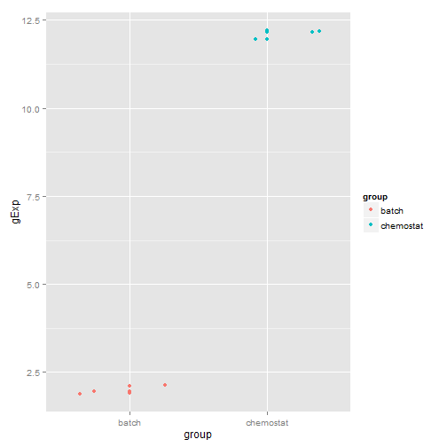 

We can see the gene with probe id 1772391_at is expressing much higher in the chemostat condition than batch condition.

iii. How many probes are identified as differentially expressed at a false discovery rate (FDR) of 1e-5 (note: this is a FDR cutoff used in the original paper)?


```r
limma.hit <- as.character(limma.results$gene.id[which(limma.results$q.value < 
    1e-05)])
str(limma.hit)
```

```
##  chr [1:725] "YKR009C" "YGL059W" "YDL216C" "YPL223C" ...
```


There are 725 probes.

iv. Save your results for later with write.table().

```r
write.table(limma.results, "array_differential_expression_results.tsv", sep = "\t", 
    row.names = TRUE, col.names = NA)
```


## Q2) RNA-Seq Analysis

### a) (1pt) Load RNA Count Data and Sanity Check

```r
count <- read.table("stampy.counts.tsv", header = TRUE, row.names = 1)
str(count)
```

```
## 'data.frame':	6542 obs. of  6 variables:
##  $ b1: int  11 40 31 63 112 17 0 4 5 0 ...
##  $ b2: int  3 26 52 87 106 21 0 2 8 1 ...
##  $ b3: int  5 10 40 53 60 15 0 2 1 0 ...
##  $ c1: int  13 71 12 51 139 7 0 11 5 1 ...
##  $ c2: int  5 41 18 78 142 6 0 0 5 0 ...
##  $ c3: int  17 48 32 100 127 2 2 3 2 1 ...
```

```r
head(count)
```

```
##           b1  b2 b3  c1  c2  c3
## 15S_rRNA  11   3  5  13   5  17
## 21S_rRNA  40  26 10  71  41  48
## HRA1      31  52 40  12  18  32
## ICR1      63  87 53  51  78 100
## LSR1     112 106 60 139 142 127
## NME1      17  21 15   7   6   2
```

```r
heatmap(cor(count))
```

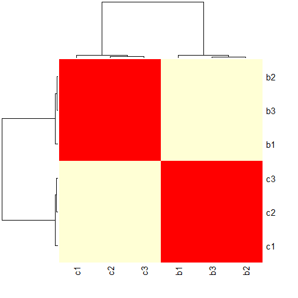 

i. What are dimensions of the dataset? 
There are 6542 rows and 6 columns. The rows represent RNA, columns represent samples. In RNA count data, each row represents count data but each row in array data represent DNA expression level data.


ii. Do a sanity check to make sure there is no sample swap by plotting a heatmap of the sample correlations.


```r
# install.packages('gplots')
library(gplots)
```

```
## KernSmooth 2.23 loaded
## Copyright M. P. Wand 1997-2009
## 
## Attaching package: 'gplots'
## 
## The following object is masked from 'package:stats':
## 
##     lowess
```

```r
heatmap.2(cor(count), Rowv = FALSE, Colv = FALSE, dendrogram = "none", trace = "none")
```

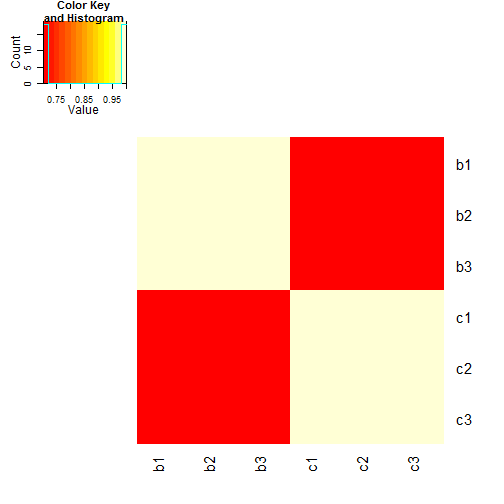 

There is no sample swap.

### b) (2pt) edgeR Differential Expression Analysis


```r
library(edgeR)
dge.glm <- DGEList(counts = count, group = group)
str(dge.glm)
```

```
## Formal class 'DGEList' [package "edgeR"] with 1 slots
##   ..@ .Data:List of 2
##   .. ..$ : int [1:6542, 1:6] 11 40 31 63 112 17 0 4 5 0 ...
##   .. .. ..- attr(*, "dimnames")=List of 2
##   .. .. .. ..$ : chr [1:6542] "15S_rRNA" "21S_rRNA" "HRA1" "ICR1" ...
##   .. .. .. ..$ : chr [1:6] "b1" "b2" "b3" "c1" ...
##   .. ..$ :'data.frame':	6 obs. of  3 variables:
##   .. .. ..$ group       : Factor w/ 2 levels "batch","chemostat": 1 1 1 2 2 2
##   .. .. ..$ lib.size    : num [1:6] 3420851 4487585 3415378 2529571 2990956 ...
##   .. .. ..$ norm.factors: num [1:6] 1 1 1 1 1 1
```

Now we need to estimate the dispersion values¡£

```r
dge.glm.com.disp <- estimateGLMCommonDisp(dge.glm, des, verbose = TRUE)
```

```
## Disp = 0.00551 , BCV = 0.0742
```


```r
dge.glm.trend.disp <- estimateGLMTrendedDisp(dge.glm.com.disp, des)
```

```
## Loading required package: splines
```


```r
dge.glm.tag.disp <- estimateGLMTagwiseDisp(dge.glm.trend.disp, des)
plotBCV(dge.glm.tag.disp)
```

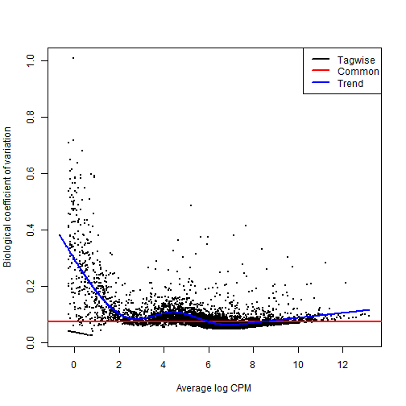 

GLM

```r
rfit <- glmFit(dge.glm.tag.disp, des)
lrt <- glmLRT(rfit, coef = 2)
rall <- topTags(lrt, sort.by = "none", n = Inf)
```

Package these results in a data.frame called 'edger.results'

```r
edger.results = data.frame(rownames(count), rall$table$PValue, rall$table$FDR, 
    rall$table$logFC, rall$table$LR)
colnames(edger.results) = c("gene.id", "p.value", "q.value", "log.fc", "test.stat")
```

Save the result

```r
write.table(edger.results, file = "stampy.edger.results.tsv", row.names = TRUE, 
    col.name = NA, sep = "\t")
```


i.How many genes are differentially expressed between conditions at a false discovery rate (FDR) of 1e-5?

```r
sum(edger.results$q.value < 1e-05)
```

```
## [1] 2669
```

```r
edger.hit <- as.character(edger.results$gene.id[which(edger.results$q.value < 
    1e-05)])
```

There are 2669 differentially expressed between conditions at a false discovery rate (FDR) of 1e-5.

ii. How many genes are differentially over-expressed in chemostat compared to batch medium samples at a false discovery rate (FDR) of 1e-5?

```r
summary(de.glm <- decideTestsDGE(lrt, p = 1e-05, adjust = "BH"))
```

```
##    [,1]
## -1 1154
## 0  3873
## 1  1515
```

There are 1515 differentially over-expressed in chemostat compared to batch medium samples at a false discovery rate (FDR) of 1e-5.

### c) (2pt) DESeq Differential Expression Analysis
i.

```r
library(DESeq)
```

```
## Loading required package: locfit
## locfit 1.5-9.1 	 2013-03-22
##     Welcome to 'DESeq'. For improved performance, usability and
##     functionality, please consider migrating to 'DESeq2'.
```

```r
deSeqDat <- newCountDataSet(count, group)
head(counts(deSeqDat))
```

```
##           b1  b2 b3  c1  c2  c3
## 15S_rRNA  11   3  5  13   5  17
## 21S_rRNA  40  26 10  71  41  48
## HRA1      31  52 40  12  18  32
## ICR1      63  87 53  51  78 100
## LSR1     112 106 60 139 142 127
## NME1      17  21 15   7   6   2
```

```r
deSeqDat <- estimateSizeFactors(deSeqDat)
sizeFactors(deSeqDat)
```

```
##     b1     b2     b3     c1     c2     c3 
## 1.0211 1.2962 0.9538 0.7866 0.9004 1.1317
```

```r
deSeqDat <- estimateDispersions(deSeqDat)
plotDispEsts(deSeqDat)
```

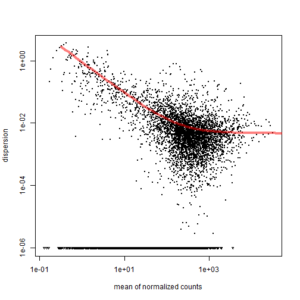 

ii.

```r
results <- nbinomTest(deSeqDat, levels(group)[1], levels(group)[2])
str(results)
```

```
## 'data.frame':	6542 obs. of  8 variables:
##  $ id            : chr  "15S_rRNA" "21S_rRNA" "HRA1" "ICR1" ...
##  $ baseMean      : num  9.24 41.32 29.32 70.7 116.84 ...
##  $ baseMeanA     : num  6.11 23.24 37.47 61.46 84.79 ...
##  $ baseMeanB     : num  12.4 59.4 21.2 79.9 148.9 ...
##  $ foldChange    : num  2.024 2.556 0.565 1.301 1.756 ...
##  $ log2FoldChange: num  1.017 1.354 -0.823 0.379 0.812 ...
##  $ pval          : num  0.13 0.0476 0.0171 0.0684 0.0101 ...
##  $ padj          : num  0.1899 0.0777 0.0307 0.1076 0.0188 ...
```


Package these results in a data.frame called 'deseq.results' with four columns:

```r
deseq.results <- data.frame(results$id, results$pval, results$padj, results$log2FoldChange)
colnames(deseq.results) <- c("gene.id", "p.value", "q.value", "log.fc")
```

Save the results

```r
write.table(edger.results, file = "stampy.deseq.results.tsv", row.names = TRUE, 
    col.names = NA)
```


iii.How many genes are differentially expressed between conditions at a false discovery rate (FDR) of 1e-5?

```r
sum(deseq.results$q.value < 1e-05)
```

```
## [1] 2198
```

```r
deseq.hit <- as.character(deseq.results$gene.id[which(deseq.results$q.value < 
    1e-05)])
```

So there are 2198 genes differentially expressed between conditions at a false discovery rate (FDR) of 1e-5.


iv. How many differentially expressed genes are identified by both 'edgeR' and 'DESeq'?

```r
both.hit <- intersect(deseq.hit, edger.hit)
summary(both.hit)
```

```
##    Length     Class      Mode 
##      2176 character character
```

So there are 2176 differential expressed genes identified by both 'edgeR' and 'DESeq'.

### d) (2pt) voom Differential Expression Analysis
i. voom normalizes the counts before it converts counts to log2-cpm.

```r
norm.factor <- calcNormFactors(count)
```


ii. Use voom to convert count data into logged CPM data and then use limma to identify differentially expressed genes between conditions.

```r
dat.voomed <- voom(count, des, plot = TRUE, lib.size = colSums(count) * norm.factor)
```

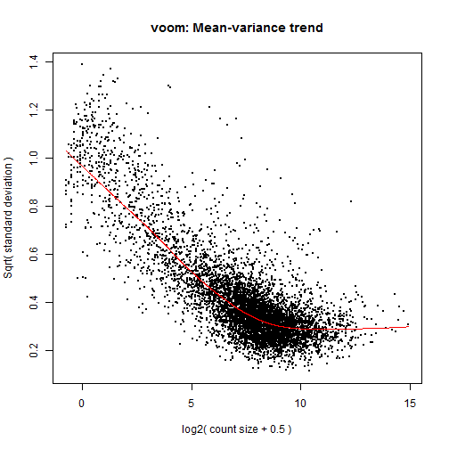 

```r
fit <- lmFit(dat.voomed, des)
fit <- eBayes(fit)
voomed.all <- topTable(fit, coef = 2, n = Inf, sort.by = "none")
```

Package these results in a data.frame

```r
voom.limma.results <- data.frame(rownames(voomed.all), voomed.all$P.Value, voomed.all$adj.P.Val, 
    voomed.all$logFC, voomed.all$t)
colnames(voom.limma.results) <- c("gene.id", "p.value", "q.value", "log.fc", 
    "test.stat")
```

Save the results

```r
write.table(voom.limma.results, file = "stampy.limma.results.tsv", row.names = TRUE, 
    col.names = NA)
```


iii.How many genes are differentially expressed between conditions at a false discovery rate (FDR) of 1e-5?

```r
voom.limma.hit <- as.character(voom.limma.results$gene.id[which(voom.limma.results$q.value < 
    1e-05)])
summary(voom.limma.hit)
```

```
##    Length     Class      Mode 
##      1794 character character
```

So there are 1794 genes are differential expressed between conditions.


iv. What fraction of the genes identified using voom+limma are also found by edger and DESeq methods? For example if the DE analysis using voom+limma found 1000 genes and both edgeR and DESeq found 500 of these, the fraction of genes found would be 5001000=0.5.


```r
all.hit <- intersect(voom.limma.hit, both.hit)
(fraction <- length(all.hit)/length(voom.limma.hit))
```

```
## [1] 0.9989
```


So the fraction is 0.9989.

### e) (3pt) Comparison of Differential Expression Analyses
i. create a Venn diagram.

```r
# install.packages('VennDiagram')
library(VennDiagram)
de.genes <- list(edgeR = edger.hit, DESeq = deseq.hit, voom.limma = voom.limma.hit)
plot.new()
venn.plot <- venn.diagram(de.genes, filename = NULL, fill = c("red", "blue", 
    "green"))
grid.draw(venn.plot)
```

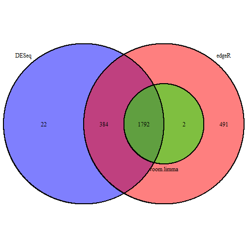 

ii. Create a smear plot

```r
plotSmear(dge.glm, de.tags = all.hit)
```

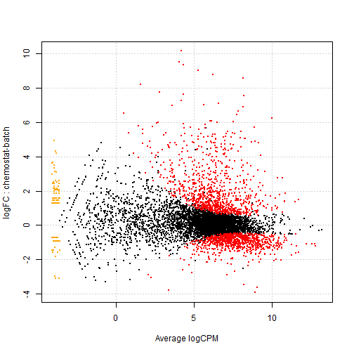 

The smear dots are labeled with different colors. We can see the putative DE genes are labeled as red dots which are relatively away from the 0 at logFC scale. The upper part of red dots indicate they are over-expressed genes while the below red dots are the under-expressed genes.

iii.There are two genes identified by edgeR and voom+limma but not by DESeq. Illustrate the logged counts of them. Compare the (log) counts of these two genes with those of two genes identified by the three methods.


```r
outgene <- setdiff(voom.limma.hit, all.hit)
featureCounts <- count[outgene, ]
```

so the two genes are YMR058W and YPL271W.


```r
featureDat <- data.frame(gene.id = factor(rep(rownames(featureCounts), ncol(featureCounts))), 
    cond = factor(rep(group, each = nrow(featureCounts))), log.count = log2(unlist(featureCounts)))
stripplot(gene.id ~ log.count, featureDat, groups = cond, auto.key = TRUE, jitter = TRUE)
```

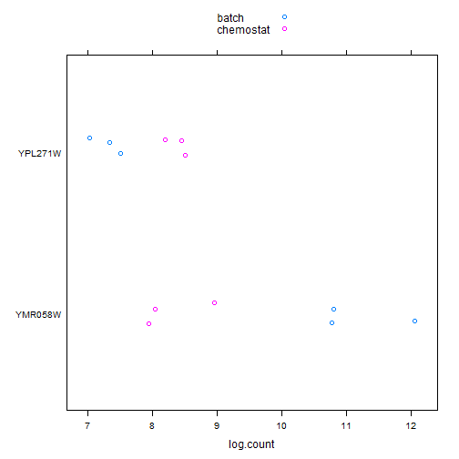 

We choose other two genes in the overlapped set of three methods.

```r
set.seed = 1000
twonumber <- sample(1:length(all.hit), size = 2)
twogenes <- all.hit[twonumber]
str(twogenes)
```

```
##  chr [1:2] "YJL217W" "YHR020W"
```


```r
featureCounts <- count[twogenes, ]
featureDat <- data.frame(gene.id = factor(rep(rownames(featureCounts), ncol(featureCounts))), 
    cond = factor(rep(group, each = nrow(featureCounts))), log.count = log2(unlist(featureCounts)))
stripplot(gene.id ~ log.count, featureDat, groups = cond, auto.key = TRUE, jitter = TRUE)
```

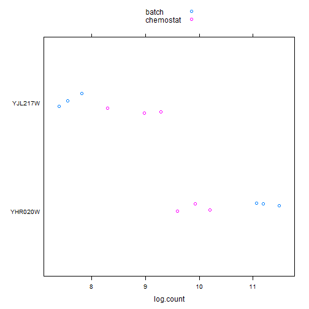 


## Q3: Compare RNA-Seq with array DEA
i.Venn diagram

```r
de.genes.2 <- list(RNA_Seq = edger.hit, Microarray = limma.hit)
plot.new()
venn.plot.2 <- venn.diagram(de.genes.2, filename = NULL, fill = c("red", "green"))
grid.draw(venn.plot.2)
```

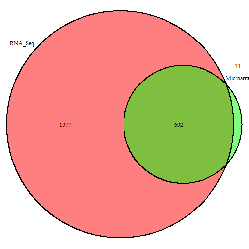 


ii Density plots
The first plot includes the densities of q-values of the genes analyzed by both platforms (i.e., genes shared by both data frames).

```r
shared.genes <- intersect(edger.results$gene.id, limma.results$gene.id)
shared.edger.results <- subset(edger.results, edger.results$gene.id %in% shared.genes)
shared.limma.results <- subset(limma.results, limma.results$gene.id %in% shared.genes)
RNA_Seq_q.value <- shared.edger.results$q.value
Microarray_q.value <- shared.limma.results$q.value
densityplot(~RNA_Seq_q.value + Microarray_q.value, auto.key = TRUE)
```

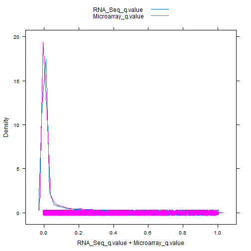 

The second plot includes the densities of q-values of ALL genes analyzed by at least one of the platforms.

```r
all.genes <- limma.results$gene.id
all.edger.results <- subset(edger.results, edger.results$gene.id %in% all.genes)
RNA_Seq_all_genes <- all.edger.results$q.value
Microarray_all_genes <- limma.results$q.value
densityplot(~RNA_Seq_all_genes + Microarray_all_genes, auto.key = TRUE)
```

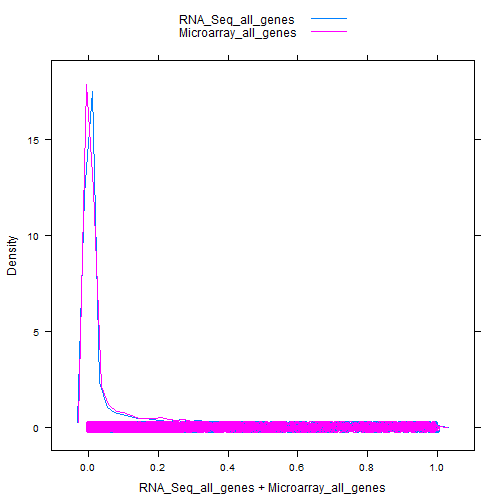 

iii Interesting genes

```r
jDat <- dget("featGenesData-q3-DPUT.txt")
str(jDat)
```

```
## 'data.frame':	30 obs. of  5 variables:
##  $ gene.id  : Factor w/ 5 levels "YDR345C","YDR384C",..: 1 1 1 1 1 1 2 2 2 2 ...
##  $ cond     : Factor w/ 2 levels "batch","chemostat": 1 1 1 2 2 2 1 1 1 2 ...
##  $ log.count: num  12.59 13.07 12.63 8.33 8.43 ...
##  $ arrayExp : num  11.59 11.62 11.81 7.53 7.73 ...
##  $ probe.id : Factor w/ 5 levels "1770682_at","1778111_at",..: 1 1 1 1 1 1 2 2 2 2 ...
```


```r
Groupidentity <- function(mygene) {
    my.gene <- list(RNA_Seq = edger.hit, Microarray = limma.hit, mygene = mygene)
    names(my.gene) <- c("RNA_Seq", "Microarray", mygene)
    plot.new()
    venn.plot.mygene <- venn.diagram(my.gene, filename = NULL, fill = c("red", 
        "blue", "green"), height = 500, width = 500)
    grid.draw(venn.plot.mygene)
}
```


```r
gene <- levels(jDat$gene.id)
```

We've got YDR345C first.

```r
Groupidentity(gene[1])
```

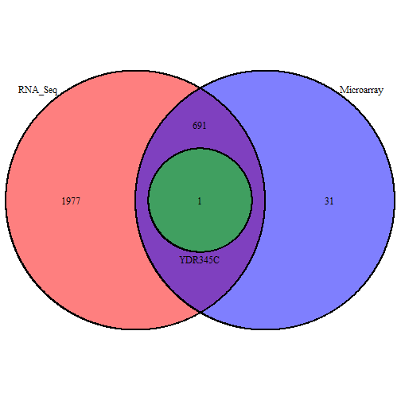 

For the Venn diagram, gene YDR345C is identified as a DE gene in both platform (RNA_Seq and microarray) because it shows in the overlap area, and in the plot of chunk stripplot-five-interesting-genes, the two group of dots (YDR345C) are seperate with each other. That means these two methods having the same conclusion .

We move on for the second gene:

```r
Groupidentity(gene[2])
```

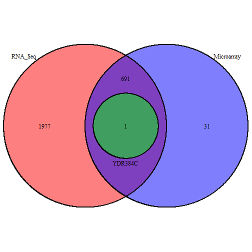 

Gene YDR384C is similar with gene YDR345C, which  shows in the plot could also support conclusion of plot of chunk stripplot-five-interesting-genes.

Then, we do the third one.

```r
Groupidentity(gene[3])
```

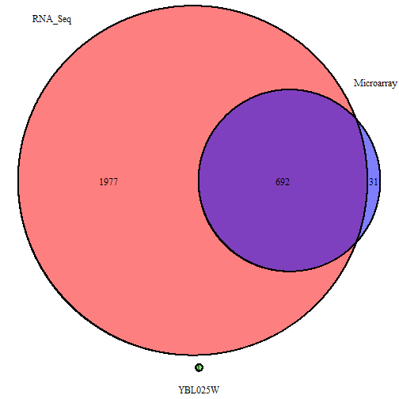 

Gene YBL025W, Venn diagram shows this gene is not identified, the plot also shows that because two group of dots (YDR345C) are close to each other .

We do the forth one.

```r
Groupidentity(gene[4])
```

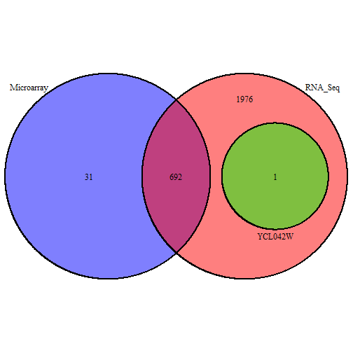 

Venn diagram shows that Gene YCL042W is considered to be DE only in RNA-Seq platform but not in Microarray platform, which is the same as the plot shown: seperate dots in the RNA-Seq side but very close dots in the microarray side.

We do the last one.

```r
Groupidentity(gene[5])
```

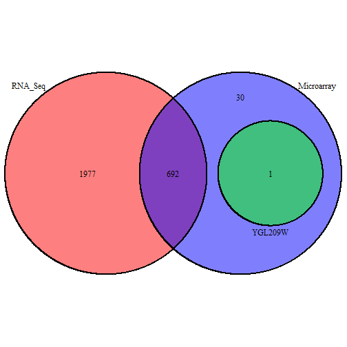 

For the last one, gene YGL209W, in contrast with YCL042W, Venn diagram shows that it is considered to be DE in microarray platform but not in RNA-Seq platform, this is also consistent with the plot result.

In general the agreement between the two platforms is good. But in some cases, e.g.YCL042W and YGL209W, these two platform show different sensitivity.
